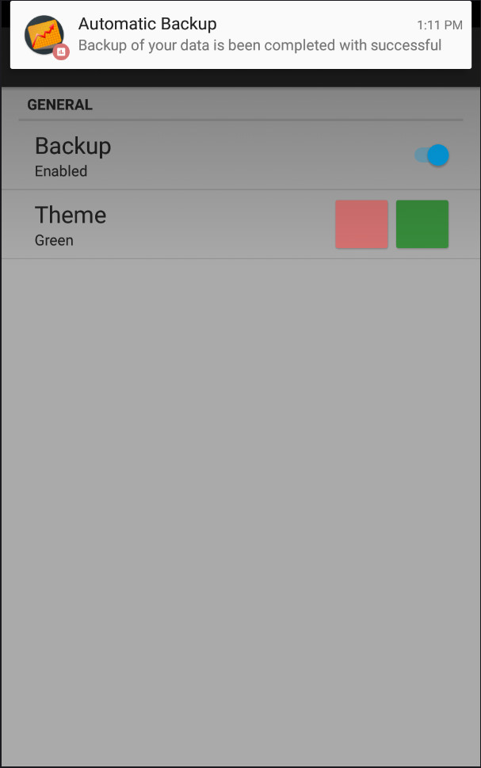
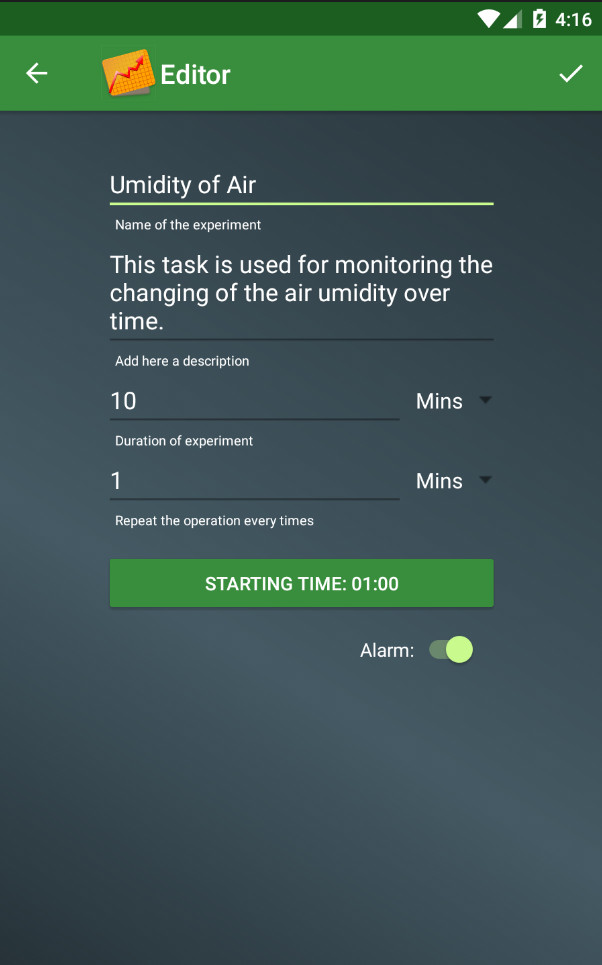

# DataTracker

App created for Udacity.com in the course: Google Challenge Scholarship: Android Developer
 
<i>Skill level</i>: <b>intermediate</b>

The aim of this app was to keep track of data collected during an experiment, or simply for monitoring something, as quality of water, air or any data you want and display them in a chart. This app have also an alarm for remember the user when do the next measure. It is completed only partially, it is able to start service, which show a log message at the time selected with a timepicker. A service, kept alive also after reboot, for an automatic backup on server of the data collected, is added, but the server side is not yet implemented. It is also provided of notifications and two themes.

 

  
  
  

  
  
  

  

